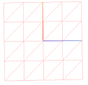

### CPSC 535P 2020 WT1Digital Humans

## Assignment 2

### Cloth Simulation

### Due date: Nov 23, 11:59pm

For this assignment you will implement, in Python, a highly simplified version of the Baraff-Witkin cloth simulator. You will demonstrate the simulator on a simple square piece of cloth handing by two adjacent corners.

The technical specification of the assignment is the [paper](https://www.cs.cmu.edu/~baraff/papers/sig98.pdf). The following specifies what you DO NOT have to do for the assignment and can safely skip in the paper description

1. Collision detection.
2. Sparse matrices and iterative solvers. You can use the direct solvers in the [numpy.linalg](https://numpy.org/doc/stable/reference/routines.linalg.html) package.
3. General constraint handling
4. Damping

The cloth will be discretized into a 4 x 4 grid of nodes connected in the pattern shown.

.

The corresponding glTF and Blender files are provided for your convenience, but you can also generate this mesh programmatically. You can use the dhutils package to load the glTF and visualize the cloth mesh (we will add some convenience functions soon).

The main complication for this assignment is computing f and df/dx as outlined in Section 4.1 of the paper. You can also compute this using automatic differentiation (using as python package such as [autograd](https://github.com/HIPS/autograd) or [JAX](https://github.com/google/jax).

### Handin

Email a zip file with your code plus a README file describing your work at a high level. We will use face-to-face grading, as in Assignment 1.
